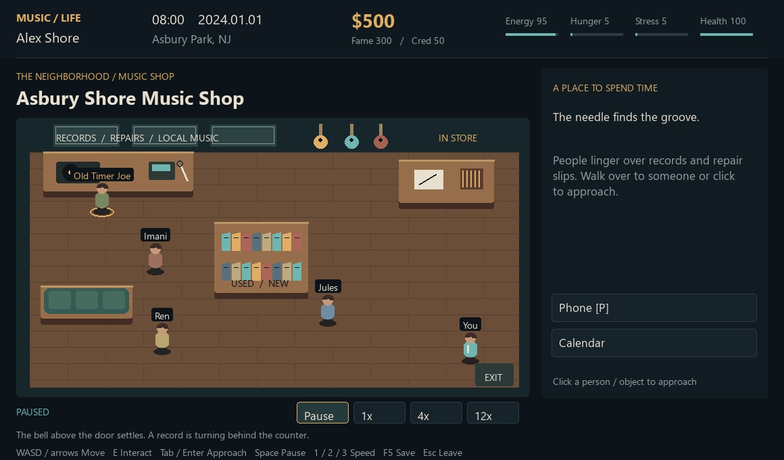
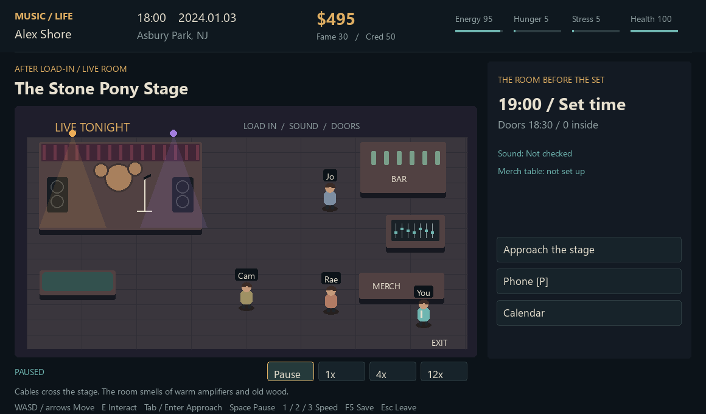
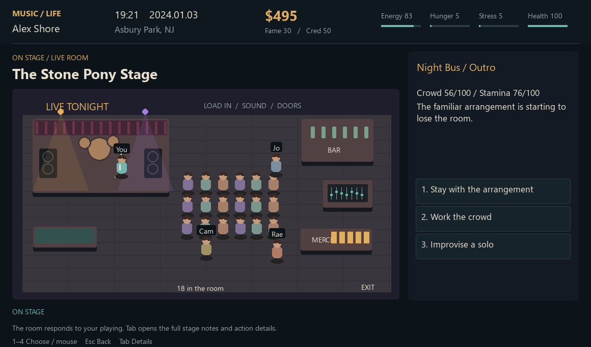

# Music Life

A desktop musician-career sandbox. Write material, rehearse, find work, play rooms, make records, and decide what kind of life can support it. Actions consume time. Reading menus does not. The calendar, finances, fatigue, and other musicians respond to what happens.

## Play

Use Python 3.11 or newer and a desktop display. This build was verified with Python 3.14.6 and pygame-ce 2.5.7 on Windows.

```powershell
python -m pip install -r requirements.txt
python main.py
```

On Windows, double-click `run_game.bat`. It uses the project's `.venv` if present, otherwise `python` on PATH. The core game works offline, without an account or API key. The existing optional AI dialogue adapter is separate from the required dependencies; scripted conversations remain available without it.

## Controls

- Arrow keys or mouse: select; Enter or click: confirm.
- Left/right, Page Up/Down, or wheel: change menu page.
- 1–7: choose the corresponding visible row.
- Escape: cancel or return where that choice is available. It never accepts a purchase or deal.
- Tab: read the full selected option, scene details, and commitments.
- J: read the persistent journal. Arrow keys/wheel scroll documents.
- F5: save between sessions, or pause and save inside a music shop, including an ongoing shop signing. Finish live shows, journeys and other activity sessions before quick-saving.

The HUD shows cash, reputation, time, location, and physical condition. There is no recommended-next-action tracker or automatic transport to obligations. Shift listings are optional, individual bookings. Missing work costs pay and reliability. Your career goals are your own.

## Playable systems

- Character creation; location-specific rest, food, practice, equipment, and recording services.
- Resumable songwriting drafts with separate lyrics, melody, and arrangement sessions; home demos, studio recording, single distribution, and ordered EP/album releases. Writing and recording consume energy, and fatigue affects quality.
- A live booking desk with local shows and tour itineraries, dated windows, guaranteed show pay, nonrefundable booking fees, route fares, and baseline living-cost estimates. Booking conflicts or unavailable rooms commit nothing.
- Separate settlements for played, missed and cancelled dates; saved itineraries resume and close correctly. Local shows can fit around an active tour.
- Venue equipment rental charges a visible fee and returns temporary gear after the set.
- Player-selected setlist order; live sets with material quality, fatigue, instrument condition, audience response, and penalties for repeating the same stage action. Each venue slot can be played once per day.
- Daily streaming royalties, editorial playlist pitches with cooldowns, music reviews, and vinyl manufacturing with a 21-day lead time.
- Optional paid shifts that require attendance, recurring living costs, staff wages, and vehicle rentals that expire.
- City travel through physical transit hubs or vehicles, with route-appropriate timing and costs; cancellation before ticket purchase, optional fuel stops, and roadside repairs.
- Other musicians travel and work independently. Locate them in town, meet them, and develop collaborations.
- Daily and weekly world updates remain distinct through long actions and month boundaries.
- Persistent careers, including songs, release dates, bands, staff, schedules, inventory, contacts, unfinished drafts, and world relationships.

## Saves

The System menu and F5 write `savegame.json` in the project folder. Writes are atomic, and the previous file is kept as `savegame.json.bak`. The new v2 JSON archive preserves shared references between career objects. Legacy v1 JSON saves remain readable, but information never stored by those versions cannot be recovered. A new career gives the cleanest starting state. Historical pickle saves are not supported.

There is no automatic save on exit. The journal is included in a saved career.

## Verification and remaining scope

```powershell
python -m pip install pytest
python -m pytest -q
```

The current suite passes 392 tests. Club regressions cover preparation, concurrent crew work, save/resume, stage entry, lateness, cancellation, missed dates and a complete booked night through merchandise sales and settlement. `tests/test_live_bookings.py` covers quote/decline, atomic booking validation, tour save/resume and settlement, missed dates, cancellation, temporary gear rentals, and local shows alongside tours. `tests/test_playable_career.py` exercises actual menu handlers for writing, recording, releasing, gigs, bus travel, work attendance, album distribution, pressing, save/resume, and real Pygame keyboard input. Renderer captures verify the title and main career screens without requiring a screenshot of the desktop.

This is a substantially improved playable build, not a claim that every late-career module is complete. The repository still contains advanced systems with limited menu integration. Multi-year economy tuning, wider career playtesting, unique artwork for every city, and further separation of the large game coordinator remain development work. The soundtrack and music performances are still primarily simulated rather than generated playable songs.

## Activities and direction

Passenger travel supports a working phone for calendar checks, scene news, calls and live bookings. Committed calls and booking administration use journey time. Continue until arrival or an interruption to skip routine hourly confirmations. Road delays consume actual time; the last leg stops at arrival.

Autograph signings use a queue and a limited advertised session. Set a pace, handle a personal request, respond to the waiting crowd and decide whether to extend. Real merchandise stock limits sales; fan response and fatigue affect the outcome. Signings require an invitation and presence at a music shop. The same city can host another session after seven days while a tour is active.

### Playable music shops

Visit a music shop through City Map & Travel, then open Current Location. The shop opens as a room with a counter, repair bench, records and a signing table. Click people or furniture to approach them, or walk with WASD/arrows and press E nearby. Tab selects a target; Enter approaches it. Escape returns from conversations or leaves the room.

Space pauses; 1/2/3 choose 1x/4x/12x speed. At 1x, one real second advances one game minute. Reading a paused room is free. During a signing, staying near the table serves the queue under your chosen policy; walking away or taking a call leaves it waiting. Significant decisions and calendar commitments pause the clock.

Each shop has a persistent host and three recurring locals, one of whom visits on alternate days. Conversations and signatures affect their relationships and memories; these relationships influence future turnout. Poorly handled crowds affect the host's welcome and repeat invitations. Released artists can ask the host for a signing even without an active tour.

F5 pauses and saves your position, the queue and any pending signing decision. Loading an ongoing shop signing returns to the same shop. Leaving through the door requires closing an active signing; the remaining queue is included in its settlement.



The current shops share one stylized room layout. Anonymous attendees use a simulated queue, while the named regulars persist individually. Small clubs and bar stages now use the room described below. See [activity design](docs/ACTIVITY_DESIGN.md) for the next steps.

### Playable club nights

Clubs and bar stages open as walkable rooms with a stage, sound desk, merchandise table, green room, promoter and recurring local. Use the same movement, interaction and pause/speed controls as the shop. The phone opens calendar, contacts and live bookings.

Load-in begins ninety minutes before the set. Soundcheck takes twenty-five minutes; a faulty monitor can require a replacement lead. Laying out merchandise takes fifteen minutes and requires stock. A hired roadie or sound engineer can prepare sound or merchandise while you spend time elsewhere; ability affects soundcheck quality. Crew work and preparation survive saving.

Doors open thirty minutes before the set, and the crowd arrives over time. Approach the stage when ready. The room stays visible through song selection and each section of the performance; Tab opens stage notes and action details. Preparation, fatigue, crowd rapport and lateness affect the actual set. Merchandise sells only if its table was prepared. Played, cancelled and missed prepared bookings leave a persistent record with the promoter.

F5 saves between sets; save before restarting an already running game to load this update. Full-screen financial records and contact lists remain available through the phone. Larger halls and festivals retain their existing interfaces. Club layouts are shared, and crowds are simulated groups rather than individually modeled attendees.





## Project layout

- `main.py`: application entry point.
- `game/game.py`: game state and simulation coordinator.
- `game/music_interface.py`: shared title, menu, HUD, and journal presentation.
- `game/career_actions.py`, `game/world_actions.py`: executable career/place menu actions.
- `game/state_archive.py`, `game/save_manager.py`: versioned career persistence.
- `game_data/`: authored world, catalogs, and artwork.
- `tests/`: simulation and interaction regressions.

Artwork provenance and generation prompts are in `game_data/art/README.md`.
